# Project deep unsupervised learning
This project is an evaluate generation images from noise of three different methods

## Table of contents
1. VAE (Variational Autoencoders)
   1. Methodology
   2. Results
   3. Conclusions
2. GMMs (Gaussian Mixture Models)
   1. Pure GMM
   2. AE and GMM
   3. VAEs and GMM
3. GAN (Generative adversarial network)
   1. [First dense model](#First dense model)
   2. [Second dense model](#Second dense model)
   3. [CNN model](#CNN model)
   4. [CNN model for discriminator and dense model for the generator](#CNN model for discriminator and dense model for the generator)

## VAEs

In the context of a Deep Unsupervised Learning course, a comparative analysis was conducted on various methods for generating images using Variational Autoencoders (VAEs). Three different approaches were explored, focusing on model architectures, latent layer size, and computational resources used during training.

### Methodology:
Several VAE models were implemented and trained using two main types of architectures: dense layers and convolutional layers. The size of the latent layer and the number of training epochs were varied to assess their impact on the quality of generated images.

### Results:

Dense vs. Convolutional Architecture:
A significant difference in performance was observed between VAE models with Dense architecture and those with convolutional architecture since they are better suited for image generation in VAEs because they effectively capture visual features, require fewer parameters, and can extract complex features, resulting in more realistic and detailed images compared to dense models.
for more details , you can access the notebook named ["VAEs CNN.ipynb"](https://github.com/Dopo0/Project-deep-unsupervised-learning/blob/main/GAN/GAN_G_Dense_D_Dense_1.ipynb)

  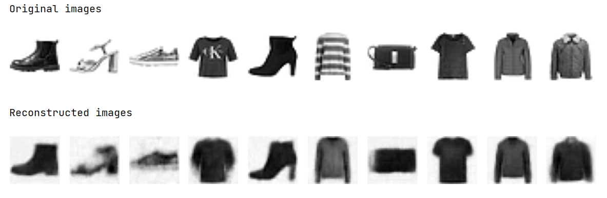
   
  <em>Figure: Results of the CNN model Fashion MNIST dataset after 15 epochs</em>

Latent Layer Size:
Increasing the size of the latent layer from 8 to 64 resulted in significant improvements in the quality of generated images.
This suggests that a larger latent layer enables a richer and more expressive latent representation.
for more details , you can access the notebooks named ["VAEs_Dense_Latent_8.ipynb"](https://github.com/Dopo0/Project-deep-unsupervised-learning/blob/main/GAN/GAN_G_Dense_D_Dense_1.ipynb) and ["VAEs_Dense_Latent_64.ipynb"](https://github.com/Dopo0/Project-deep-unsupervised-learning/blob/main/GAN/GAN_G_Dense_D_Dense_1.ipynb)

  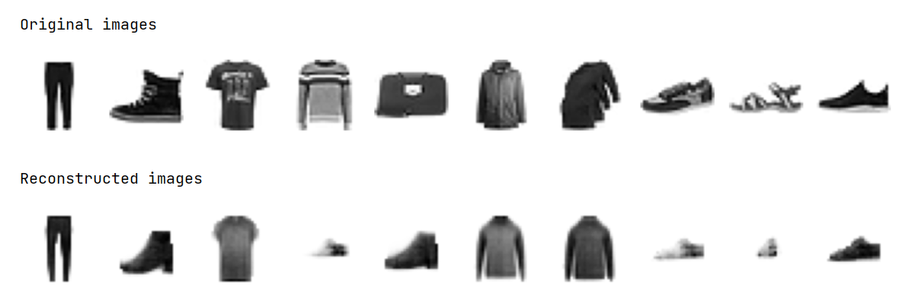
   
  <em>Figure: Results of the Dense model with latent dimension 8 on Fashion MNIST dataset after 30 epochs</em>

  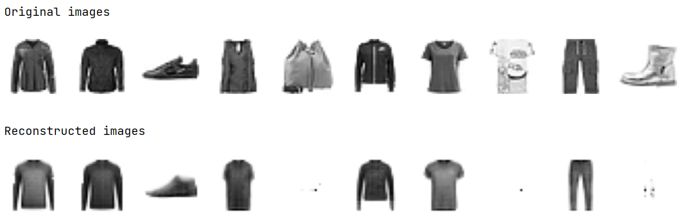
   
  <em>Figure: Results of the Dense model with latent dimension 64 on Fashion MNIST dataset after 30 epochs</em>

Learning Efficiency:
VAE models with convolutional architecture exhibited significantly lower initial loss compared to Dense models.
This indicates greater efficiency in learning representations from the beginning of training.

Comparison of Final Loss:
The final loss of VAE models with dense and convolutional layers was evaluated.
Lower final loss values were observed for convolutional models compared to Dense models, indicating better convergence during training.

### Conclusions:
The results suggest that convolutional architecture is more suitable for image generation using VAEs, as it allows for more efficient learning and higher quality generated images. Additionally, the importance of using a sufficiently large latent layer to capture the complexity of input data is highlighted. 

  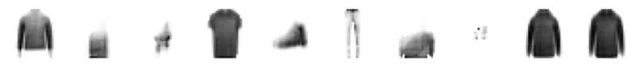
   
  <em>Figure: Results of the Dense model with latent dimension 8 from random noise on Fashion MNIST dataset after 30 epochs</em>

  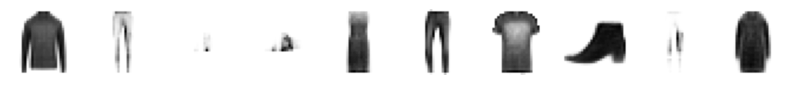
   
  <em>Figure: Results of the Dense model with latent dimension 64 from random noise on Fashion MNIST dataset after 30 epochs</em>

  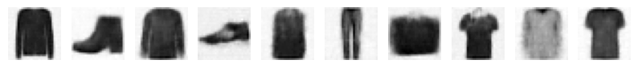
   
  <em>Figure: Results of the CNN model from random noise on Fashion MNIST dataset after 15 epochs</em>

## GMMs

### Pure GMM 
Initially, the approach involved setting the number of components in the GMM equal to the number of distinct labels in the FashionMNIST dataset. This method yielded relatively accurate results; however, it failed to capture all the distinct classes present in the dataset. Notably, some classes, such as t-shirts, were repeated, indicating a limitation in the model's capacity to differentiate between similar categories.
for more details , you can access the notebook named ["GMMS.ipynb"](https://github.com/Dopo0/Project-deep-unsupervised-learning/blob/main/GAN/GAN_G_Dense_D_Dense_1.ipynb)

  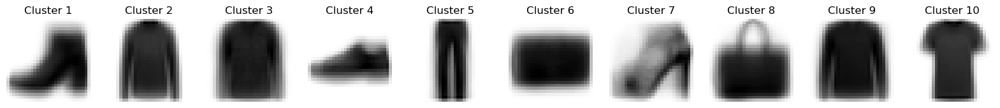
   
  <em>Figure: Results of pure GMMs with 10 components on Fashion MNIST dataset after 150 epochs</em>

### AE and GMM

This second approach combines the power of autoencoders (AE) and Gaussian Mixture Models (GMMs) to generate synthetic images resembling the FashionMNIST dataset. The process starts with training a convolutional autoencoder (CAE) on the FashionMNIST dataset, aiming to learn a compact representation of the input images in a latent space. The trained CAE's encoder part is then utilized to extract latent vectors from the FashionMNIST dataset. Subsequently, a range of components for the GMM is explored, evaluating the Bayesian Information Criterion (BIC) score for each component count to determine the optimal number of clusters. This step is crucial for selecting the most suitable configuration of the GMM for capturing the underlying distribution of the latent vectors effectively.
for more details , you can access the notebook named ["AE_GMMs.ipynb"](https://github.com/Dopo0/Project-deep-unsupervised-learning/blob/main/GAN/GAN_G_Dense_D_Dense_1.ipynb)

  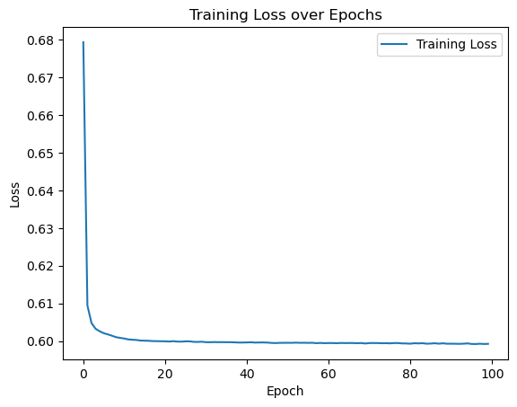
  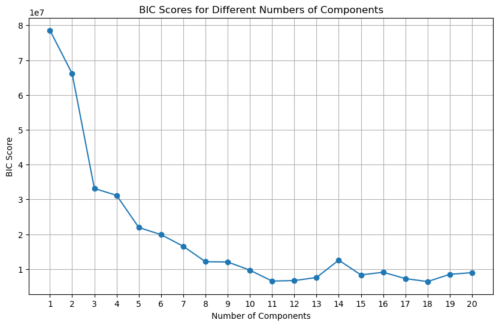
   
  <em>Figure: left: Loss over epochs AE, Right: BIC scores GMMs from 1 to 20 components</em>

After identifying the optimal number of components, in this case, 18, the GMM is trained on the latent vectors. Following GMM training, samples are drawn from the learned distribution, effectively generating synthetic latent vectors. These latent vectors are then passed through the decoder part of the CAE to reconstruct corresponding synthetic images. Finally, the generated images are visualized to assess the quality and diversity of the synthetic samples. This approach leverages the representation power of CAEs to learn meaningful latent representations and employs GMMs to capture the complex distribution of these latent vectors, culminating in the generation of synthetic images that closely resemble the FashionMNIST dataset. Through visual inspection of the generated images, the effectiveness of the AE-GMM framework in producing realistic synthetic data can be evaluated and compared against the original dataset.

  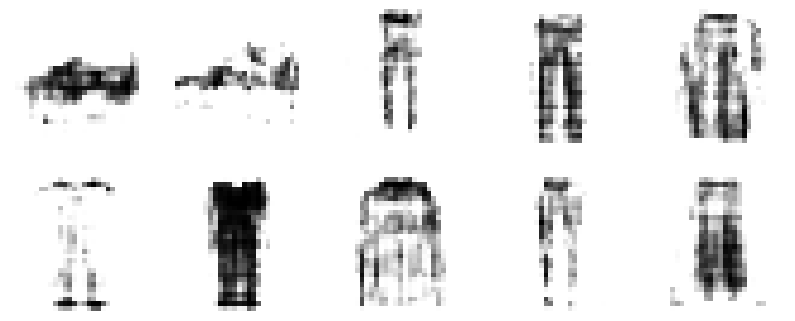
   
  <em>Figure: Results using 2 components on AE+GMM model</em>

  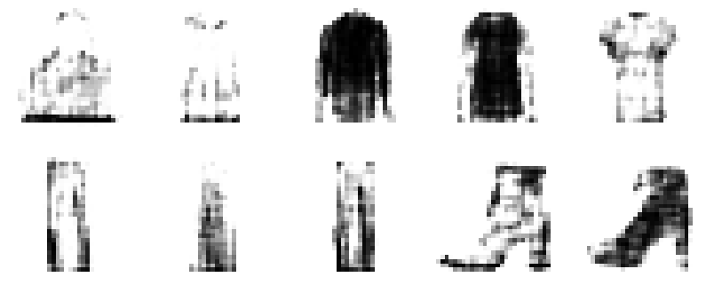
   
  <em>Figure: Results using 11 components on AE+GMM model</em>

  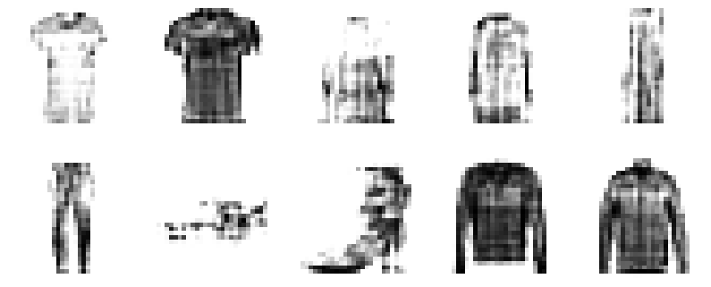
   
  <em>Figure: Results using 18 components on AE+GMM model</em>

### VAEs and GMM

we maintain the essence of the previous strategy, but instead of using a standard autoencoder (AE), we adopt a Variational Autoencoder (VAE). VAEs offer a probabilistic interpretation of latent space by modeling the latent variables as probability distributions. This probabilistic framework allows for more flexible and robust latent space representations, potentially resulting in improved generation quality and diversity compared to traditional autoencoders.

The workflow remains largely consistent with the previous approach. First, we train a Variational Autoencoder on the FashionMNIST dataset to learn a compact and structured latent representation. Unlike conventional autoencoders, VAEs learn to encode data into latent variables that follow a predefined probability distribution, typically a Gaussian distribution. Consequently, the latent space captures both the mean and variance of each latent variable, enabling more nuanced and expressive representations of the input data.

we sample latent vectors from the learned distribution of the GMM and decode them using the decoder portion of the VAE to generate synthetic images. This process capitalizes on the probabilistic nature of VAEs to sample latent vectors that capture the underlying data distribution more accurately, potentially leading to higher-quality synthetic images. Finally, we visualize the generated images to assess their fidelity and diversity, enabling a comparative analysis with the original FashionMNIST dataset.

  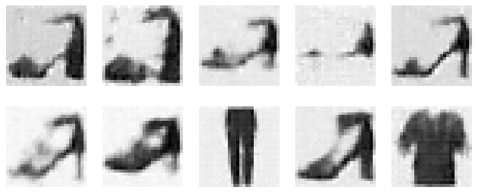
   
  <em>Figure: Results using 2 components on VAEs+GMM model</em>

  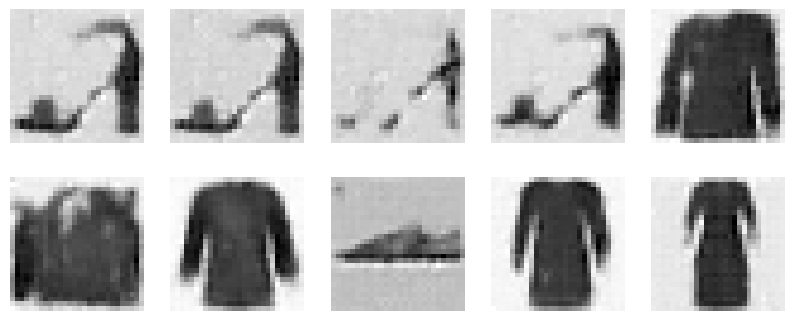
   
  <em>Figure: Results using 11 components on VAEs+GMM model</em>

  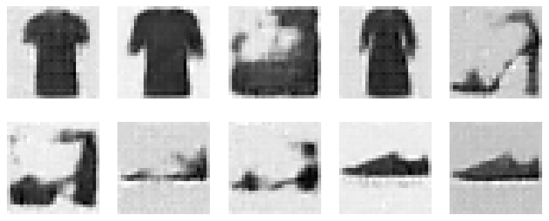
   
  <em>Figure: Results using 18 components on VAEs+GMM model</em>

Overall, by incorporating Variational Autoencoders into the generation pipeline, we aim to enhance the quality and diversity of the generated images while maintaining the interpretability and structure of the latent space. This approach represents a sophisticated fusion of generative modeling techniques, leveraging the strengths of both VAEs and GMMs to generate realistic synthetic data resembling the FashionMNIST dataset.
for more details , you can access the notebook named ["VAEs CNN GMMs.ipynb"](https://github.com/Dopo0/Project-deep-unsupervised-learning/blob/main/GAN/GAN_G_Dense_D_Dense_1.ipynb)

## GAN

### First dense model

    

The first dense model has three hidden layers with a progressively increasing number of neurons: 256, 512, and 1024. It uses LeakyReLU activation function, which allows for a small, non-zero gradient when the unit is not active. This model does not employ dropout, which means it may be more prone to overfitting compared to a model that does. The output is generated through a single linear layer with Sigmoid activation, which is typical for binary classification. Due to the larger hidden layers, it has more parameters, making it more complex.

for more details , you can access the notebook named ["GAN_G_Dense_D_Dense_1.ipynb"](https://github.com/Dopo0/Project-deep-unsupervised-learning/blob/main/GAN/GAN_G_Dense_D_Dense_1.ipynb)

    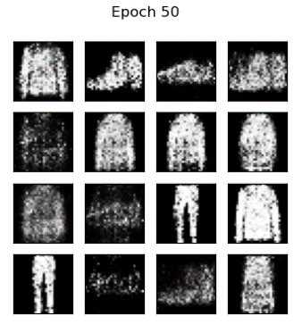
    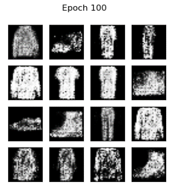
    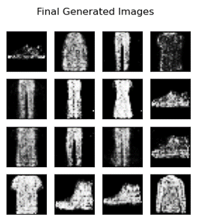
     
    <em>Figure: Images show the results of the model when we train it for 50 epochs , 100 epochs and 150 epochs which will be our final generation.</em>

### Second dense model

The second dense model also has three hidden layers but with decreasing sizes: 256, 128, and 64. It uses the same LeakyReLU activation function but incorporates dropout with a probability of 50%, introducing regularization to help prevent overfitting. It similarly concludes with a single linear layer with Sigmoid activation for the output. This model is less complex due to smaller hidden layers, meaning it has fewer parameters to learn.

for more details , you can access the notebook named "GAN_G_Dense_D_Dense_2.ipynb"

  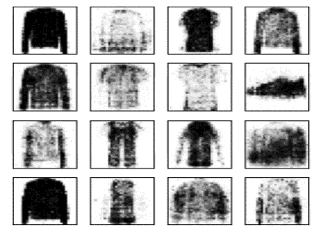
   
  <em>Figure: Results of the Second Dense GAN Model on Fashion MNIST dataset after 150 epochs</em>

### CNN model for discriminator and dense model for the generator

The generator is designed with a noise input dimension of 100, an initial dense layer, and a combination of upsampling and convolutional layers that expand the noise into a 2D structure. The use of ReLU and Tanh activation functions facilitates the learning of complex patterns. This model is more sophisticated due to convolutional and upsampling layers, allowing it to create finer details, which can be crucial for generating realistic Fashion MNIST images.

For the discriminator, the model processes input images through multiple convolutional layers with LeakyReLU activations and employs dropout to prevent overfitting. The complexity is higher due to more channels in convolutions, which might provide better feature extraction for classifying real versus generated images.

The model with a convolutional generator yielded better results due to a more balanced power dynamic between the discriminator and the generator. Both components of the GAN would be more evenly matched in their capacity to analyze and generate images, leading to more coherent and recognizable outputs. This highlights the importance of designing both the generator and discriminator in a GAN with compatible complexities to achieve high-quality generation of images.

for more details , you can access the notebook named "GAN_G_CNN_D_CNN.ipynb"

  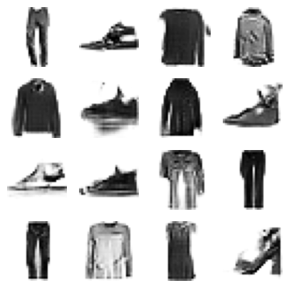
   
  <em>Figure: Results of the CNN model for discriminator and dense model for the generator on Fashion MNIST dataset after 150 epochs</em>

### CNN model for discriminator and dense model for the generator 

The generator also starts with a noise input dimension of 100 and an initial linear layer, but it lacks the convolutional and upsampling complexity of the first, relying solely on linear layers. It uses LeakyReLU and Tanh activations, and its simplicity with only linear layers means it’s likely faster to train but may produce less detailed images.

The discriminator model has a similar structure but with fewer channels, making it less complex and possibly quicker to train. Reduced convolution channels might limit its feature detection capability but improve generalization due to a simpler model. Both use Sigmoid in the output layer for binary classification.

The results are evidently not desirable as the images consist of unrecognizable, noisy patterns. This indicates that the linear generator in the GAN was unable to capture and reproduce the complexities of the data it was trained on, which in this case would be Fashion MNIST images.

The poor performance could be due to the imbalance between the capabilities of the generator and the discriminator. The discriminator, being a convolutional neural network (CNN), likely has a far greater ability to distinguish between real and fake images than the dense generator has to generate plausible images. Thus, the generator fails to create convincing images to fool the discriminator, resulting in it not learning meaningful features.

for more details , you can access the notebook named "GAN_G_Dense_D_CNN.ipynb"

  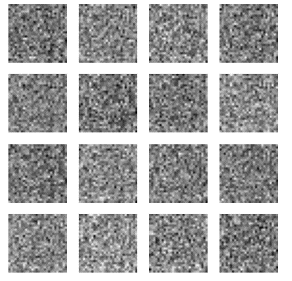
   
  <em>Figure: Results of the CNN model for discriminator and dense model for the generator on Fashion MNIST dataset after 150 epochs </em>

